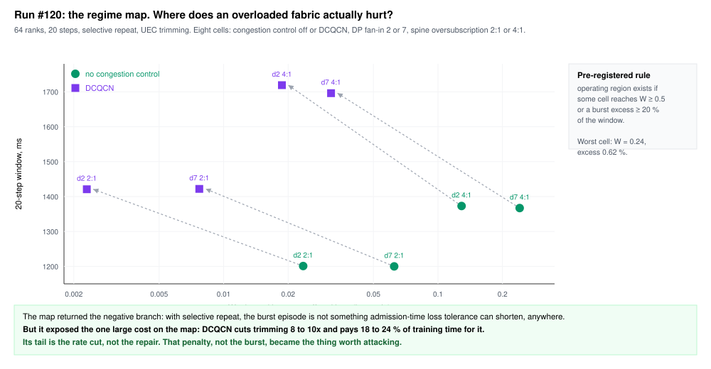
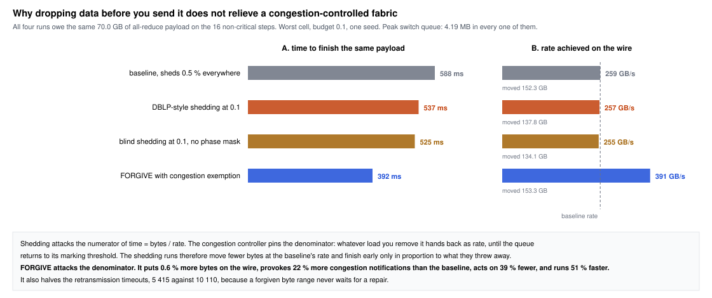

# Phase-aware bounded loss, from a four-node prototype to a UEC-shaped fabric

Progress review for Yashar Ganjali and Zechen Ma, 18 September 2026.

Prepared by Joe Fang, in collaboration with Zechen Ma. The simulation
platform, the cluster runs and the analysis reported here are my
work in this repository; the DBLP line of work they revise is joint.

Work covered: a fork of ASTRA-sim at commit `518bd51` and a fork of its
bundled ns-3 RDMA backend, from 20 July 2026 to today. Eight cluster
runs, numbered #117 to #126, over about 300 simulated configurations.

Slides are separated by rules. Figures are SVG in `figures/`.

**Terms used throughout.** An *arm* is one simulated configuration; a
*comparison* is a set of arms sharing a seed and a random selection
stream so their results can be subtracted; a *run* is one dispatch of
many comparisons to the cluster, numbered in the CI ledger as #117, #120
and so on. A *cell* is one point of the eight-point fabric map. The *trim
ratio* is trimmed payload bytes divided by offered bytes, written W in
the artifacts. The *loss budget* is the fraction of eligible
data-parallel bytes a policy is allowed to discard, written p_low on
critical steps and p_high elsewhere. *Critical steps* are the protected
ones, pinned to 1, 2, 3 and 20; *CLR* in the May preprint means the same
thing. The *training window* is wall-clock time for all 20 steps.

---

## 1. The one-slide version

This is the revision of our own DBLP work. The question we took on after
the May preprint was whether its phase-aware bounded-loss result survives
on a fabric that looks like what large training jobs will actually run
on. To ask that we had to build the fabric first, because the backend
ASTRA-sim ships with models none of it.

Four things came out of it, in this order.

1. **A negative result we trust.** On a modern lossy fabric, where the
   transport repairs a loss with one selective retransmission rather than
   by rewinding a window, dropping gradient bytes before you send them
   recovers almost nothing. The relief we measured was a property of
   go-back-N recovery, and every bounded-loss result we were able to
   find, ours included, was measured on a transport of that class.
2. **The real cost on that fabric, measured.** Congestion control is what
   costs time. DCQCN cuts packet trimming by eight to ten times and pays
   18 to 24 % of training time for it.
3. **A mechanism that recovers that time.** The receiver forgives what
   the fabric trimmed, and a sender with allowance left ignores the
   congestion controller until the receiver reports that allowance
   spent. At the worst cell of our map the first version of this
   recovered 12.9 to 14.1 % of training time for 6.75 to 6.89 % of
   gradient bytes, against 2.4 to 3.3 % for sender-side shedding at the
   same budget.
4. **The operating point we would publish.** Pacing the forgiveness with
   a coin, so that a forgivable trim is forgiven with probability 0.05
   and repaired otherwise, recovers about 16 % of training time for 1.2
   to 1.3 % of gradient bytes at a budget of 0.1. That loss falls inside
   the 0.7 to 3.3 % band MLT profiles as tolerable, and our own May
   GPT-2 runs survived 40 %.

The time comes from how long a sender may ignore the congestion
controller; forgiveness is the currency that licenses it, and the coin
spends that currency slowly, so the licence lasts the whole step at
almost no loss.

---

## 2. Where we started: the May draft

The May preprint evaluates DBLP on three workers and one server running
centralized all-reduce, on models from 5M to 125M parameters, with
microbursts injected by hand at 60 to 90 % loss. Data on UDP, control on
TCP, no congestion control in the sender. Headline: 24.8 % average
training time reduction.

That is a prototype result, and we said so at the time. In May we listed
four things we would have to settle ourselves before claiming it at LLM
scale.

| # | The question | Why it mattered |
| --- | --- | --- |
| 1 | Sparsification | Is dropping gradients different from compressing them, and what happens when both run at once? |
| 2 | Compute and transport interleaving | Our worker loop blocks on communication. A modern framework hides most of it. How much of 24.8 % survives overlap? |
| 3 | CLR identification | The detector is a gradient-norm test run once per epoch. Does the phase signal exist at LLM scale, and what does the schedule cost? |
| 4 | Topology, centralized against ring | Hub-and-spoke concentrates pressure at one NIC. Does anything survive on a leaf-spine fabric with ring or direct collectives? |

Slide 18 reports where each one landed.

---

## 3. The decision: build an instrument, not a testbed

We could not answer any of the four on hardware we have. A 64-rank
Llama-class job on a rail-optimised Clos with packet trimming is not
something this lab can rent, and the questions are all about the
network, not about accuracy.

So we chose ASTRA-sim 2.0 with Chakra execution traces over the bundled
ns-3 RDMA backend, and accepted one hard limit up front: the simulator
computes no gradients, so it can never tell us whether a model survives
the loss. Everything about convergence is deferred to a separate
experiment, and we say so in every document.

What the simulator can settle is the mechanism: what the fabric does,
what the transport does, and what that costs in time. That was the
missing half of the May draft.

The cost was that the backend did not model any of the fabric we cared
about. Building it is most of what the first six weeks were.

---

## 4. Timeline

Four bands: build the instrument, make it a real experiment platform,
map the regime, then FORGIVE. Red markers are cluster runs.

---

## 5. Act I, July and early August: what "UEC-shaped" meant in code

The stock ns-3 RDMA backend is a lossless RoCEv2 model: PFC on, no
trimming, go-back-N recovery. Ultra Ethernet is the opposite on every
axis. We changed the backend, one mechanism at a time, each with its own
fixture.

| What we added | Why |
| --- | --- |
| Packet trimming, aligned to UEC 1.0.3 | A congested switch replaces the payload and forwards the header, so the receiver learns about the loss in one one-way delay instead of a timeout |
| Best-effort fabric controls, PFC off | Ultra Ethernet does not run PFC on the data class; keeping it would have hidden every effect we wanted to see |
| Selective repeat for trimmed and missing ranges | The change slide 8 turns out to be about. In the code the flag is `transport_recovery.selective_repair` |
| Aggregated transport telemetry, then a zstd raw stream | Per-packet accounting cost more than we could afford at 64 ranks; the aggregate counters are what every number in this deck comes from |
| DCQCN as a switchable congestion control, with rate-cut counters | Before this, every arm we had ever run had no congestion control at all |

The last row is worth pausing on. Run #117 was already collected before
we noticed that every generated configuration wrote `CC_MODE 12`, which
no handler implements. Queue pairs were sending at line rate inside a
static window. That is the same transport our own prototype had, by
accident, but it is not what anyone deploys.

---

## 6. Act II, August: making it an experiment platform

The scientific content of this month is small and the infrastructure
content is large, but the infrastructure is why the later results are
believable.

- **Matched arms.** Every comparison runs four configurations off one
  random selection stream, so the messages the sender-side baseline
  suppresses are exactly the ones the receiver-side run may forgive.
  Nothing is compared across seeds.
- **Sixteen seeds** on the 16-rank configuration, drawn as eight-digit
  chunks of pi, so the seed choice is not ours to nudge.
- **The cluster.** Heavy comparisons run on just-in-time SLURM runners on
  the UofT DCS cluster, minted per job. A run is 20 to 56 arms, about
  five hours each.
- **Permanent artifacts.** Every run writes a release bundle with
  per-arm summaries, telemetry, the exact profile, and a provenance
  attestation. Every number in this deck can be recomputed from one.
- **A pinned critical-step schedule**, `[1, 2, 3, 20]`, derived from
  literature independent of our own preprint, with the circularity guard
  written down: the claim under test cannot also be its own
  justification.

---

## 7. Run #117, 1 September: the first statistical result

Sixteen seeds, 16 ranks, 2:1 fabric, go-back-N, no congestion control.
Three matched arms: tight baseline at p = 0.005 everywhere, the
phase-aware policy at 0.005 on critical steps and 0.1 elsewhere, and a
loose baseline at 0.1 everywhere.

Paired per seed, Student t at fifteen degrees of freedom. The baseline
and policy columns are means over seeds of each level; the change column
is the mean over seeds of each per-seed difference, so it does not equal
the ratio of the two columns beside it.

| quantity | baseline | policy | change | 95 % CI |
| --- | ---: | ---: | ---: | --- |
| training window, 20 steps | 7145.1 ms | 6853.5 ms | 291.7 ms, 3.91 % | [1.13, 6.68] % |
| worst all-reduce of the episode | 1026.0 ms | 872.7 ms | 153.4 ms | [5.0, 301.7] ms |
| loose baseline, 10 % on every step | 7145.1 ms | 6463.3 ms | 681.8 ms, 9.42 % | [7.03, 11.82] % |

Report the second row in milliseconds and not as a percentage. The
per-seed ratio averages 10.8 % with an interval of [-0.6, 22.2] %, which
spans zero because the baseline varies so much by seed. The milliseconds
are significant; the ratio is not.

The phase bound is not free and not expensive: it costs 242 ms across
steps 1 to 3, which is most of the policy's 292 ms gain, and costs
nothing measurable at the tail.

One more finding, which turned out to be the important one. Relief
correlates 0.93 with the number of trims the policy prevented, at 11.9 ms
per million, and -0.01 with the number of bytes it discarded. The policy
discarded 1.98 GiB of gradient and the fabric re-carried 156 GiB less.

---

## 8. The control arm that invalidated it

One arm in that run used selective repeat instead of go-back-N, on the
same 20-step workload and the same seven-source burst, over a 2:1 fabric
at 64 ranks. Its retransmitted-per-offered ratio is 0.08x to 0.13x
against 7x to 25x in the go-back-N arms, and its trim ratio is 0.02
against 2.2 to 10.4.

Under go-back-N a single trimmed packet rewinds a whole window, and with
no congestion control the queue is still full when the sender rewinds, so
the re-sent bytes are trimmed again. Measured on the sixteen-seed
configuration, discarding one gradient byte removed about 79 bytes from
the wire. Under selective repeat a trim costs one repair packet and one
round trip, so there is no window to re-carry and no comparable
multiplier.

Relief across our go-back-N arms ran from 3.9 to 11.1 %. The
selective-repeat arm gains 0.78 %. The policy worked exactly as designed.
There was simply nothing left for it to relieve.

We treat this as the finding, not the embarrassment. Every bounded-loss
result our literature reviews turned up was measured against a transport
whose recovery amplifies loss: MLT and OptiReduce against TCP or UDP with
millisecond timeouts, and our own May evaluation against its
bitmap-and-probe rounds. It is the motivating negative result of the
paper we want to write.

---

## 9. Run #120, 6 September: the regime map

If the burst episode still hurts somewhere, admission-time tolerance has
a home. We pre-registered the rule before running: an operating region
exists if some cell reaches a trim ratio of 0.5, or a burst excess of at
least 20 % of the window.

Eight cells, 64 ranks, selective repeat throughout. Congestion control
off or DCQCN, DP fan-in 2 or 7, spine oversubscription 2:1 or 4:1.

The worst cell reaches a trim ratio of 0.24, and the worst burst excess
is 0.62 % of the window. The rule returns the negative branch. We
withdrew the episode-shortening claim the same day.

The map did establish two facts. Trimming is a steady-state property of
how the fabric is provisioned, not of the burst: it multiplies about
2.7x with fan-in and about 5.5x with oversubscription, and the burst step
looks like every other step. And the burst is a non-event under selective
repeat in all eight cells: it drains in 30 to 37 ms without congestion
control and in 63 to 146 ms with it, against an 18.8 ms serialisation
floor.

---

## 10. What the map exposed instead

DCQCN is the only large cost on the map.

| | no congestion control | DCQCN | change |
| --- | ---: | ---: | --- |
| trim ratio, worst fabric | 0.24 | 0.032 | 7.6x lower |
| 20-step window, worst fabric | 1367 ms | 1696 ms | 24 % longer |
| bytes re-sent after trims | 24 % of offered | 3.7 % | 6.5x lower |
| rate cuts per run | 0 | 13.5 million | |
| retransmission timeouts | about 100 | 10 166 | about 90x |

This is a controller doing its job. It trades trimmed bytes for time,
and across the four fabrics of the map the price is 18 to 24 % of the
training run.

It also told us where the time goes. Under DCQCN a trimmed flow takes
four to seven times as long as an untrimmed one, against 1.7 to 2.7 times
without congestion control. The tail is the rate cut, not the repair.
A loss policy that is polite to congestion control cannot touch it. That
is what pointed at the mechanism on the next slide.

---

## 11. The pivot: FORGIVE

Three shedding domains now share one budget law. `admission` is the
mechanism from our May preprint, a sender-side draw that suppresses a
whole message. `recovery` forgives at the receiver but leaves congestion
control alone. `recovery_exempt` forgives and also lets the sender ignore
rate cuts while the receiver still has allowance to forgive.

One design decision is worth defending here. The exemption covers every
congestion notification, not only the ones a trim caused. On this fabric
the ECN marking threshold is 800 KB at 400 Gb/s while the trim point is
4 MiB, so most marks fire long before anything is trimmed. At the worst
cell the run takes 13.5 million rate cuts and records 3.4 million trims,
and since a trim can cause at most one mark, at least 74 % of the marks
are ECN-originated. Suppressing only the notification our own
forgiveness provoked could not move the window.

The revocation rule is what keeps this honest. The receiver grants the
exemption on the acknowledgements it already sends and reports in one bit
when forgiving every byte it is missing would exceed the step's
tolerance, and the sender follows the latest report it has. Nothing new goes on the data path; the whole
protocol is two bits on messages the transport already sends.

---

## 12. The design of record, in one paragraph

Each receiving rank opens one allowance per training step, a fraction p
of the bytes that step owes it, pooled across every sender into that
rank. On a trimmed packet the receiver flips a coin at probability P, and
if the coin says yes and the bytes already delivered have earned enough
allowance, it forgives the missing range and acknowledges it as if it had
arrived; otherwise it asks for the repair. The allowance is gone once
forgiven bytes plus the receiver's outstanding holes exceed p times what
the rank is owed, the receiver says so in one bit, and the sender obeys
its controller again from the latest report onward. The receiver also
stops a sender the moment 1 - p of that sender's share for the step has
arrived, because everything still to come would fit inside the budget
anyway. On the application side we assume the framework divides each
reduce-scatter element by the contributions that arrived, an
assumption whose conservative bound is our own May GPT-2 runs, which
survived 40 % with no rescale at all. Every rank is certified after every
step to have received at least 1 - p of what it was owed, and a run that
breaks that certificate fails.

---

## 13. Run #123, 14 September: FORGIVE v1 across the budget front

Twenty-one comparisons, 84 arms on the worst cell of the map: budgets
0.1, 0.2, 0.4 and 0.6, a mask-off ablation, a mild cell and a no-incast
control. Three seeds per budget.

The four matched arms at budget 0.4, which is where the safety property
is easiest to read:

| arm | training time | all-reduce, non-critical steps | all-reduce, critical steps | gradient lost | bytes re-sent |
| --- | ---: | ---: | ---: | ---: | ---: |
| tight baseline, 0.5 % everywhere | 1697 to 1701 ms | 36 to 37 ms | 36 to 37 ms | 0.5 % | 3.5 to 3.7 % |
| phase-aware shedding, 0.4 | 1491 to 1519 ms | 25 to 26 ms | 35 to 37 ms | 32 % | 2.1 % |
| FORGIVE with exemption, 0.4 | 1340 to 1360 ms | 12 to 13 ms | 34 to 36 ms | 21.3 to 21.5 % | 2.7 to 3.0 % |
| unmasked shedding, 0.4 everywhere | 1444 to 1477 ms | 23 to 25 ms | 22 to 26 ms | 40 % | 1.5 to 1.6 % |

Both shedding arms drop messages at the sender and differ only in whether
the critical steps are protected. FORGIVE reaches a shorter window than
phase-aware shedding while discarding two thirds as much gradient, and
its critical steps stay within 2.4 ms of the tight baseline while the
unmasked arm's critical steps speed up by a third, which is exactly the
protection being sold.

Across the front, FORGIVE recovers 12.9 to 14.1 % of training time at
budget 0.1 for 6.75 to 6.89 % of data-parallel bytes, and 23.7 to 24.3 %
at budget 0.6 for 37.7 to 38.6 %, so each further point of loss returns
less time than the point before it. Forgiven loss stays roughly
proportional to the cap: the exempt arm spends 67 to 84 % of its
allowance at every budget, and the budget bounds the loss everywhere on
the front. Sender-side shedding never overtakes on time anywhere.

The mask ablation prices the safety property. Removing the protection on
steps 1, 2, 3 and 20 returns 5.1 more points of time for 4.4 more points of
loss. The ledger proves the mask rather than the clock: masked runs put
0.25 to 1.44 % of their forgiven bytes on those steps against the 19 to
20 % an unmasked run puts there, and the budget law verified with zero
violations in all 21 comparisons.

The number that sent us to run #125 is in the re-arm column. At budget
0.1, 35 to 37 % of exempt flows reached a spent allowance and went back
under the controller; at 0.6 almost none did.

---

## 14. Run #125, 16 September: the coin moves the operating point left

Yashar's question after the last review was whether spending the
allowance all at once is what ends the exemption early. Run #125 paces
it: a forgivable trim is forgiven with probability P and repaired
otherwise; in this run the coin is fixed per range, so a range refused
once stays refused, and run #127 draws it fresh on every trim. Worst
cell, three seeds per arm, budget 0.1 unless
a row says otherwise.

| arm | training time | gradient lost | exempt flows re-armed |
| --- | ---: | ---: | ---: |
| v1, no coin | 12.9 to 14.1 % | 6.75 to 6.89 % | 35 to 37 % |
| P = 0.25 | 16.0 to 16.2 % | 5.5 to 5.9 % | 7 to 8 % |
| P = 0.1 | 15.3 to 16.7 % | 2.6 to 2.9 % | 0 to 3 flows of 71 680 |
| P = 0.05 | 15.0 to 16.6 % | 1.2 to 1.3 % | none |
| v1 at budget 0.05 | 8.0 to 8.6 % | 3.74 to 3.77 % | 47 to 49 % |
| P = 0.25 at budget 0.2 | 17.6 to 18.0 % | 7.2 to 7.6 % | 6 to 15 flows |
| P = 0.25 at budget 0.05 | 13.5 to 14.8 % | 3.1 to 3.2 % | 16 to 17 % |

**The time gain is flat from P = 0.25 down while the loss falls with P.**
Between P = 0.25 and P = 0.05 the loss falls by a factor of four and the
training time recovered does not move outside the seed spread, so the
coin moves the operating point left rather than down.

**Lowering the budget instead of slowing the spend costs time.** At
budget 0.05 without the coin, FORGIVE recovers 8.0 to 8.6 % for 3.74 to
3.77 %, which is half the time for three times the loss of the coin at
P = 0.05.

**The re-arm column explains both.** Spending the allowance slowly keeps
it unspent, an unspent allowance is what licenses a sender to ignore the
controller, and the licence is what recovers the time. At P = 0.1 and
P = 0.05 the exemption survives the whole step for all but 3 flows of
71 680.

The headline candidate is P = 0.05 at a budget of 0.1: about 16 % of
training time for 1.2 to 1.3 % of gradient bytes, inside the 0.7 to 3.3 %
band MLT profiles as tolerable, against our own May GPT-2 runs surviving
40 %.

---

## 15. Run #126, 16 September: what the deltas are against

Three reference arms, so nobody has to take the baseline on trust.

| reference | training time | what it pays |
| --- | ---: | --- |
| zero tolerance, forgives and sheds nothing | -1.1 to +0.8 % of the fixed-low control, 5 seeds | nothing |
| forgive at 0.1 but obey DCQCN | 5.5 to 6.6 % | 6.8 to 7.0 % of gradient bytes |
| no congestion controller at all | 20.1 to 20.3 %, 3 seeds | 25.4 % of all bytes re-sent as repairs |

**The control is a true zero.** An arm that tolerates no loss at all
reads within -1.1 to +0.8 % of our fixed-low control on the worst cell
over 5 seeds, and within -2.2 to -0.4 % on the mild cell, so every delta
in this deck stands against DCQCN with no loss tolerance rather than
against a lenient baseline.

**The exemption is about half of the gain.** Forgiveness that obeys the
controller recovers 5.5 to 6.6 % for the same 6.8 to 7.0 % of gradient
bytes that FORGIVE v1 spends to recover 12.9 to 14.1 %.

**Turning the controller off is the ceiling, and FORGIVE reaches it.**
No controller at all recovers 20.1 to 20.3 % and puts 25.4 % of every
byte back on the wire as repairs; FORGIVE v1 at budget 0.4 recovers the
same 20 % while the fabric keeps its controller.

---

## 16. Run #127: running tonight

Run #127 puts the design of record on the cluster: 21 arms at budget 0.1
on the worst cell, three seeds each. The law's v1 point drops both the
coin and the stop, the coin alone and the stop alone drop one each, one
arm runs both together, the owed ablation replaces the earned allowance
with the step's plan known at step start, and a reference arm never
returns to the controller at all.

It answers which piece of the design earns the time, what the stop adds
over the coin, and whether an allowance that grows with delivery leaves
time on the table against one available in full from the first packet.
Every arm is read with two columns this deck does not yet have: the
tensor-parallel all-reduce span and re-sent bytes against the fixed-low
control, which is how we price what an exempt sender costs the rest of
the fabric.

No number in this deck comes from it.

---

## 17. Why sender-side shedding cannot do this

Shedding puts less data in flight, so the expectation is that shedding
is the arm relieving congestion. The counters say otherwise.

All four arms owe the same 70.0 GB of payload on the non-critical steps.
Peak switch queue occupancy is 4 194 316 bytes in the baseline, the same
in both shedding arms, and 4 194 268 in the exempt arm. That is the trim
threshold, to the byte, in every one of them. The queue never gets
shorter, because a closed-loop controller hands back as rate whatever
load you remove, until the queue returns to its marking point. Acted-on
notifications per GB offered fall 9.5 % for a 10 % load cut.

Time is bytes over rate. Shedding attacks the numerator and the
controller pins the denominator, so it moves fewer bytes at the
baseline's rate: 537 ms against 588 ms for 10 % fewer bytes, which is
proportional to what it threw away and nothing more. FORGIVE attacks the
denominator. It finishes the same payload in 336 ms, 75 % faster, while
putting 0.6 % *more* bytes on the wire, provoking 43 % more
notifications than the baseline and acting on 36 % fewer. Panel B of the
figure converts those times into a wire rate, which needs one assumption:
that physical bytes per logical byte is uniform across steps.

There is a structural version of the same point. The load is a seven-way
fan-in, and congestion at an incast is set by how many senders arrive at
once. Uniform shedding removes bytes from all seven senders and never
removes a sender. Seven-to-one becomes 6.3-to-one and the switch is still
oversubscribed by the same factor.

---

## 18. Where the four May questions landed

| # | Question | Where it stands now |
| --- | --- | --- |
| 1 | Sparsification | Separated, deliberately. We model pure drop with no error feedback, and we wrote down why mixing it with an error-feedback compressor is a second uncontrolled lossy layer: the optimiser's residual does not know which updates never arrived. The tolerance question is now a designed experiment rather than an assumption, and the literature gives us bounds to hit: MLT profiles 0.7 to 3.3 % at equal rounds, OptiReduce reports accuracy surviving 1 %. |
| 2 | Compute and transport interleaving | Closed by construction. Chakra traces overlap 5.4 ms of compute per node with the communication window, so what we report is exposed communication time inside a training window, not blocking transfer time. The overlap is the confound that prevents us from quoting 24.8 %. |
| 3 | CLR identification | Split into two halves. The detector is out of scope for a simulator with no gradients, so we pinned a schedule from independent literature with a written circularity guard. The ledger prices the mask at 5.1 points of time and tracks it to the byte. |
| 4 | Topology, centralized against ring | Turned from a threat into two measured axes. DP fan-in and spine oversubscription are knobs on the regime map, and they set the trim ratio, multiplying it 2.7x and 5.5x. Our fan-in 7 cell models hub-and-spoke pressure at one NIC, and it is the worst cell of the map. |

---

## 19. What is verified, what is assumed, what is not yet touched

The numbers above are one cell of one map.

Verified on three seeds or more, with matched arms and pre-registered
rules, are the negative result on selective repeat; the regime map's shape; DCQCN's
18 to 24 % time penalty at this configuration; the exempt arm's window
gain and its loss cost across the front; the coin's front below P = 0.25;
the three references of run #126; the budget law; the mask's price and
its integrity.

We assume, and name as an assumption, that a real model tolerates the
1.2 to 1.3 % of gradient bytes we spend at the headline point, and that
the framework rescales each reduce-scatter element by the contributions
that arrived. MLT profiles 0.7 to 3.3 % as tolerable and our own May GPT-2
runs survived 40 % with no rescale, so the point falls inside both;
nothing in a network simulator can test it, and the GPT-2 injection
experiment is where the assumption stops being one.

We have not touched per-packet spraying, which is how Ultra Ethernet and
Meta's MRC balance load, where we use per-flow ECMP hashing; nor NSCC,
the window-based controller the Ultra Ethernet specification defines,
where we use DCQCN; nor what an exempt job costs a neighbouring tenant;
nor anything above 64 ranks.

Our worst cell is the all-to-all schedule with all 7 DP peers sending at
once, the most incast a group of 8 can produce, so it is the stress case.
NCCL's default ring and tree schedules receive from 1 or 2 peers per
channel, which the `direct2` cell approximates: there FORGIVE at budget
0.4 recovers 10.5 to 12.5 % of training time for 2.4 % of data-parallel
bytes. Map the `direct2` figures onto a production library and read the
worst-cell figures as the stress case.

We have a mechanism result at one point of a map, on a fabric one
generation behind the target.

---

## 20. Positioning

Four literature reviews plus three papers read in full, last week.

**DBLP is our own prior work, and we are revising it rather than
competing with it.** Every arm labelled `admission` in these runs is the
preprint's sender-side mechanism, re-implemented in the simulator so the
new mechanism can be measured beside it. Nothing here is a comparison
against an outside system.

**Third-party lineage, which we should cite rather than contrast.** MLT
(NSDI 2024) has the receiver stop a tensor once (1 - p) of it has
arrived. OptiReduce (NSDI 2025) has a receiver timeout that gives up on
stragglers. The HotNets 2024 trimmable-gradients paper puts 1-bit heads
in packets so a trimmed packet is a coarser gradient rather than a lost
one, and explicitly asks for the congestion control we are proposing.
Bounded gradient loss at a receiver is not new, and we should stop
implying it is.

**What four literature reviews did not turn up.** A per-trimmed-range
receiver verdict on a fabric with selective repeat. A loss budget
denominated in bytes per (rank, step) rather than a probability. And an
RDMA flow that ignores congestion notifications under a receiver-held
loss budget that revokes itself when the allowance is spent. I would
build the paper around the third, because it is the only one that
changes what congestion control means rather than what the receiver
accepts.

---

## 21. Roadmap, in dependency order

| # | Phase | What it answers | Cost | What kills it |
| --- | --- | --- | --- | --- |
| 1 | DCQCN in its best configuration | Is the 24 % penalty inherent or is it mistuning? | 10 arms, one day | tuned DCQCN comes within 5 % of no congestion control |
| 2 | Per-packet spraying | How much of the fan-in effect is per-flow ECMP hash collision, which sprayed fabrics do not have? | one week of code, 20 arms | the exempt gain falls below 5 points under spraying |
| 3 | NSCC | Does the exemption transfer to the controller Ultra Ethernet actually ships? | three to four weeks, 24 arms | exempt gain under NSCC below 5 points |
| 4 | Workload currency | Tensor parallelism off the fabric, FSDP bytes, 128 ranks | two weeks, 30 arms | gain per eligible byte falls as the eligible share rises |
| 5 | Fairness | What does an exempt job cost a well-behaved neighbour, and does the budget bound it? | 24 arms | the neighbour's slowdown exceeds the exempt job's gain at every budget |
| 6 | Tolerance on real training | Does a current model survive the loss we actually spend, placed where the fabric placed it? | 8 GPUs, one to two weeks | the loss curve diverges at budget 0.1 |
| 7 | Robustness | Five seeds, timeout and marking-threshold sensitivity | 40 arms, one week | any headline sign flips |

Phase 1 is the one standing between our main claim and a reviewer's
first question, and it is one cluster day. Phase 2 starts in parallel
because phase 3 cannot begin without it.

---

## 22. What I would like from you

1. **Phase 6 needs a collaborator with GPUs.** The experiment is
   well-defined: export the forgiven byte ranges from an exempt run, map
   them to gradient-bucket elements, zero those elements in a PyTorch DDP
   communication hook, train a 1B-class model against an unmodified run
   at the headline point and at budgets 0.2 and 0.4. Eight GPUs for one
   to two weeks. It runs independently of the cluster work, and it is the
   only thing that can close the tolerance claim.
2. **A view on the controller.** We have DCQCN because it was the
   controller the backend already had. Our claim does not depend on it,
   but the paper's currency does. Is it worth three to four weeks to
   implement NSCC, or is DCQCN plus a tuning sweep and an argument enough
   for the venues you would target?
3. **A view on the framing.** I think the contribution is "bounded loss
   as a third congestion response, beside rate reduction and
   retransmission", with the go-back-N result as the motivating negative.
   The alternative framing is a measurement paper about what packet
   trimming plus congestion control costs a training job. The second is
   safer and smaller.

---

## Appendix: where the numbers live

Every figure and table above recomputes from a release bundle in
`BulkyCI/astra-sim`.

| Run | Date | Release tag | What it is |
| --- | --- | --- | --- |
| #117 | 1 Sep | `zuihrl5stp6ulacoogghyp4loy7xsjpj` | the sixteen-seed 16-rank configuration, go-back-N, plus sweeps |
| #120 | 6 Sep | `uwlaookzhemmwabtbwfe2yhyxepupnmw` | eight-cell regime map |
| #123 | 14 Sep | run `34867374086` | the same front with the revocation corrected, 84 arms |
| #124 | 15 Sep | main `55d5767` | Bernoulli pacing at 0.5 and 0.25, 18 single arms |
| #125 | 16 Sep | main `8213401` | budget 0.05 and the coin below 0.25, 24 arms |
| #126 | 16 Sep | main `a1b30b0` | zero tolerance, forgiveness without the exemption, no controller, 15 single arms |
| #127 | running | the design of record | 21 arms at budget 0.1, no number quoted here |

Supporting documents in this directory: `forgive-design-plain.md` is the
design of record, `results-ledger.md` says which number is quotable and
what replaces it, `forgive-related-work.md` is the positioning,
`roadmap-to-full-paper.md` the plan, and the per-run readouts are
`run-117-readout.md`, `run-120-regime-map.md` and `run-123-readout.md`.
