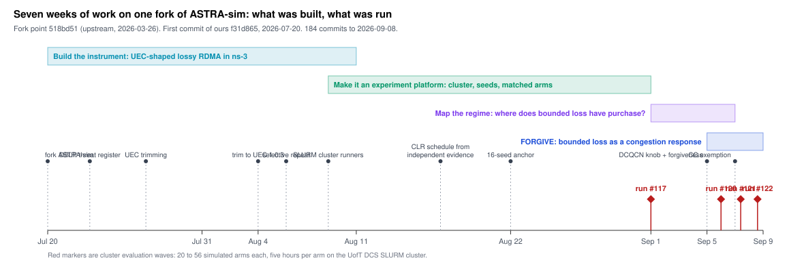
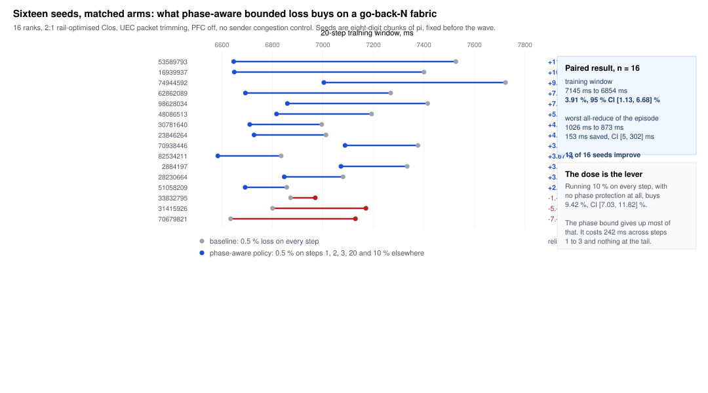
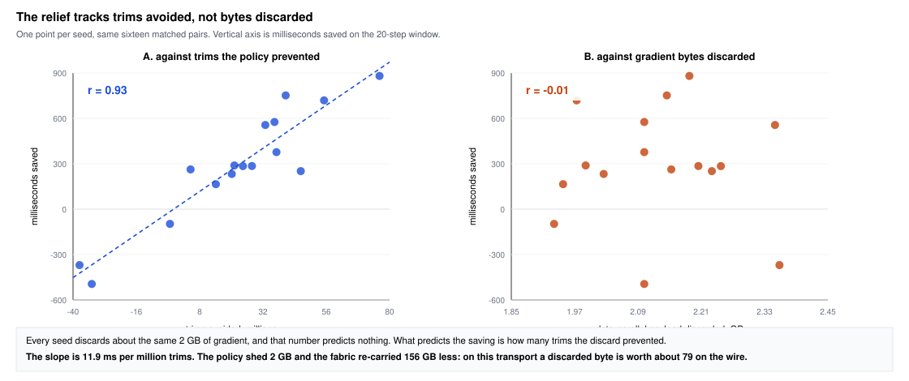
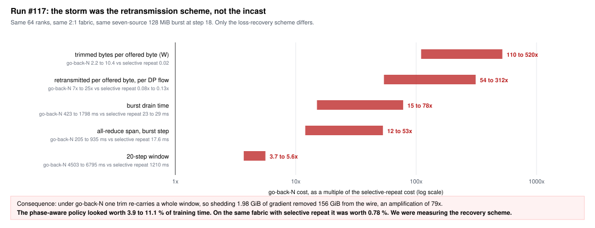
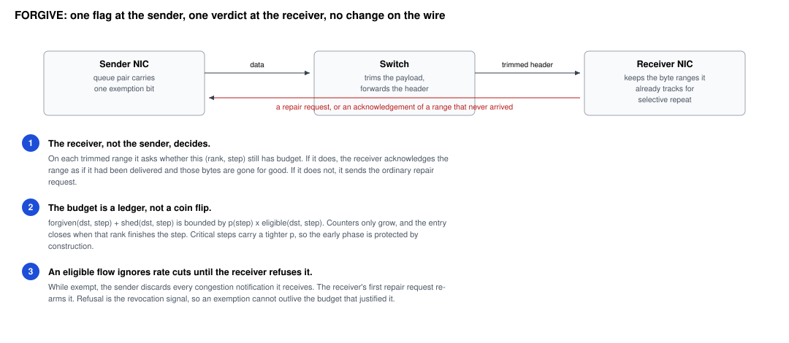
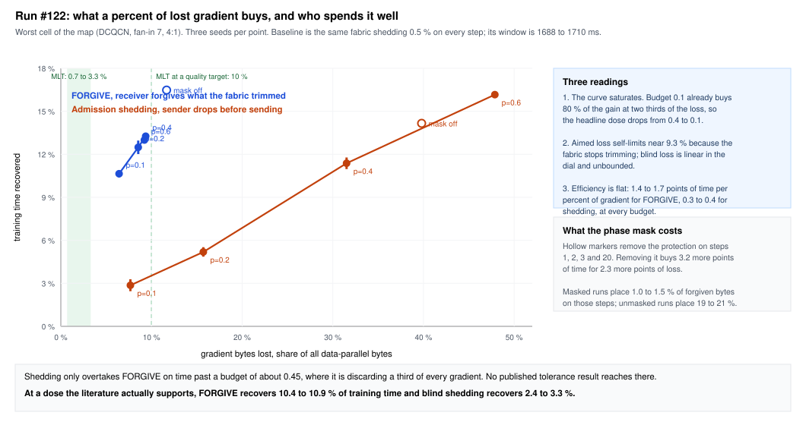

# Phase-aware bounded loss at LLM scale: what it buys, and where it stops

Progress review for Yashar Ganjali, 9 September 2026.

Prepared by Joe Fang, in collaboration with Zechen Ma. The simulation
platform, the four cluster runs and the analysis reported here are my
work in this repository; the DBLP line of work they revise is joint.

Results-first framing. The measured result is the centre; the transport
regime it holds on is stated in the same breath; the protocol work that
carries it onto next-generation fabrics is future work at the end.

Fork of ASTRA-sim at `518bd51`, our first commit `f31d865` on 20 July
2026, 184 commits to 8 September, plus a fork of the bundled ns-3 RDMA
backend. Four cluster runs, about 180 simulated configurations.

**Terms used throughout.** An *arm* is one simulated configuration; a
*comparison* is a set of arms sharing a seed and a random selection
stream so their results can be subtracted; a *run* is one dispatch of
many comparisons to the cluster, numbered in the CI ledger as #117, #120
and so on. A *cell* is one point of the eight-point fabric map. The *trim
ratio* is trimmed payload bytes divided by offered bytes. The *loss
budget* is the fraction of eligible data-parallel bytes a policy may
discard. *Critical steps* are the protected ones, pinned to 1, 2, 3 and
20; *CLR* in the May preprint means the same thing. The *training window*
is wall-clock time for all 20 steps.

---

## 1. The one-slide version

This is the revision of our own DBLP work. The May preprint showed
phase-aware bounded loss on four nodes with hand-injected loss and models
up to 125M parameters. Since then we have rebuilt the idea at LLM scale
on a simulated Ultra-Ethernet-shaped fabric where the loss is produced by
the network itself, and measured it properly.

On a fabric whose transport sends at line rate and recovers by
re-carrying a window, which is the transport class every bounded-loss
result our literature reviews turned up was measured on, phase-aware loss
delivers:

- **3.91 % shorter training window**, sixteen matched seeds, 95 % CI
  [1.13, 6.68] %.
- **153 ms off the worst all-reduce of the episode**, from 1026 ms to
  873 ms, CI [5, 302] ms.
- **9.42 %** if you drop the phase protection entirely, CI [7.03,
  11.82] %, which prices what the protection costs.

And we can now say why, which the May testbed could not. The saving
tracks the packet trims the policy prevented, at 11.9 ms per million,
correlation 0.93 across seeds. It does not track the bytes discarded at
all, correlation -0.01. Discarding 1.98 GiB of gradient removed 156 GiB
from the wire.

We also mapped the boundary. Run the same policy over selective repeat
instead of go-back-N and it buys 0.78 %. That boundary is a finding, and
it is what the last three slides are about.

---

## 2. Where we started: the May draft

The May preprint evaluates three workers and one server running
centralized all-reduce, models from 5M to 125M parameters, microbursts
injected by hand at 60 to 90 % loss, data on UDP and control on TCP with
no congestion control in the sender. Headline: 24.8 % average training
time reduction.

We listed four things we would have to settle ourselves before claiming
that at LLM scale.

| # | The question |
| --- | --- |
| 1 | Sparsification: is dropping gradients different from compressing them, and what happens when both run at once? |
| 2 | Compute and transport interleaving: our worker loop blocks on communication, a modern framework hides most of it |
| 3 | CLR identification: a gradient-norm test once per epoch, and what the schedule costs |
| 4 | Topology, centralized against ring: hub-and-spoke concentrates pressure at one NIC |

Slide 11 reports where each landed.

---

## 3. What we built, so the result means something

None of the four questions can be answered on hardware this lab has, and
the backend ASTRA-sim ships with models none of the fabric we care about.
It is lossless RoCEv2: PFC on, no trimming, go-back-N.

We changed it, one mechanism at a time, each with a fixture.

| Added | Why |
| --- | --- |
| UEC 1.0.3 packet trimming | A congested switch replaces the payload and forwards the header, so loss is learned in one one-way delay rather than at a timeout. This is what makes the loss the *fabric's*, not an injection |
| Best-effort fabric, PFC off | Ultra Ethernet does not run PFC on the data class |
| Selective repeat for trimmed and missing ranges | The alternative recovery scheme, which turned out to define the boundary of the result |
| Aggregated transport telemetry, then a compressed raw stream | Every number in this deck comes from these counters |
| DCQCN as a switchable congestion control | Added after run #117; see slide 12 |

Two things this bought us that the May testbed could not. The loss is
produced by a real incast on a real fabric model rather than injected at
a rate we chose. And Chakra traces overlap 5.4 ms of compute per node
with the communication window, so what we report is exposed
communication time inside a training window, not blocking transfer time.

---

## 4. Timeline

---

## 5. The headline: sixteen matched seeds

Three matched arms per seed, drawn from one random selection stream, so
the messages the baseline suppresses are exactly the ones the policy
considers. Seeds are eight-digit chunks of pi, fixed before the run, so
the choice was not ours to nudge.

Thirteen of sixteen seeds improve and three regress. The policy flattens
the worst seeds and barely moves the mild ones: on the four seeds whose
worst all-reduce exceeds 1.3 s in the baseline, that collective drops by
434, 497, 649 and 716 ms. That shape is the point, and slide 7 explains
it.

---

## 6. The gain is steady state, not the burst

This surprised us, and it is worth a slide because it changes what the
mechanism is for.

Eighty-four percent of the window gain accrues over steps 4 to 17, at
about 30 ms per permissive step. The burst step and its aftermath
together improve by 58 ms with a confidence interval of [-68, 184] ms,
which is to say not measurably.

So the policy is not a burst-relief mechanism, even though a burst is
what motivated it. It is a steady-state congestion mechanism: on a fabric
provisioned like this one, trimming is happening all the time, and the
policy pays for a little less of it on every permissive step.

---

## 7. Why it works, and what does not explain it

Every seed discards about the same two gigabytes of gradient. That number
predicts nothing about the saving, correlation -0.01. What predicts it is
how many packet trims the discard prevented, correlation 0.93, at 11.9 ms
per million trims.

The reason is the recovery scheme. Under go-back-N, one trimmed packet
rewinds a whole window, and with no sender congestion control the queue
is still full when the sender rewinds, so the re-sent bytes are trimmed
again. On this configuration, discarding one gradient byte removed about
79 bytes from the wire.

This is the honest mechanism story, and it is stronger than a bare
percentage: it says exactly which property of the transport the gain
comes from, which means it also tells you where the gain will and will
not appear.

---

## 8. The loss budget is the lever; the phase bound is what it costs

| arm | training window | relief | 95 % CI |
| --- | ---: | ---: | --- |
| baseline, 0.5 % on every step | 7145 ms | | |
| phase-aware policy, 0.5 % on steps 1, 2, 3, 20 and 10 % elsewhere | 6854 ms | 3.91 % | [1.13, 6.68] % |
| loose baseline, 10 % on every step | 6463 ms | 9.42 % | [7.03, 11.82] % |

The window column is the mean over seeds of each level; the relief column
is the mean over seeds of each per-seed percentage, so it does not equal
the ratio of the first column's entries.

Read the third row as the price list. Dropping ten percent everywhere,
with no protection at all, buys 9.42 %. The phase bound gives up most of
that: it costs 242 ms across steps 1 to 3, which is close to the whole
292 ms the policy gains, and it costs nothing measurable at the tail.

That is the honest shape of the trade, and it is the argument for phase
awareness rather than against it. The claim is not that the schedule is
free. It is that most of the achievable gain sits in the permissive steps
anyway, so a schedule buys the early phase back cheaply.

---

## 9. The boundary, stated plainly

One arm in the same run used selective repeat instead of go-back-N, on
the same 20-step workload and the same burst, over a 2:1 fabric at 64
ranks. Its retransmitted-per-offered ratio is 0.08x to 0.13x against 7x
to 25x in the go-back-N arms, and its trim ratio is 0.02 against 2.2 to
10.4. There is no window to re-carry, so there is no multiplier for the
policy to exploit, and relief across our go-back-N arms of 3.9 to 11.1 %
becomes 0.78 % here.

We then spent a run mapping this properly. Eight cells at 64 ranks with
selective repeat throughout, varying congestion control, fan-in and spine
oversubscription, against a rule registered before the run. The worst
cell reaches a trim ratio of 0.24 against the 0.5 the rule asked for, and
the worst burst excess is 0.62 % of the window against the 20 % the rule
asked for.

So the result on slide 5 is a property of one transport regime, and we
know where its edge is. Presenting it any other way would not
survive a referee, and we would rather say it than have it said to us.

---

## 10. Why that regime is still the right thing to publish

Three arguments, in order of strength.

**Every bounded-loss result we found lives in it.** MLT and OptiReduce
measure against TCP or UDP with millisecond timeouts, and our own May
evaluation measures against its bitmap-and-probe rounds. Classic RoCEv2
recovery is go-back-N, and it is still what a large installed base runs,
though current NICs increasingly offer selective repeat. Our four
literature reviews found nobody who has quantified what bounded loss is
worth on that class of transport at LLM scale with matched arms and a
seed band, and that is what slides 5 to 8 are.

**The mechanism explanation is what transfers, even where the number does
not.** The saving is proportional to the trims the policy prevents, and
what one prevented trim is worth is set by the recovery scheme: about
79 bytes off the wire under go-back-N, and no more than the byte itself
plus its share of a repair under selective repeat. That is a statement
about where to look for a gain, and it correctly told us not to expect
one on the selective-repeat arm. It is not a formula and we should not
dress it as one.

**The boundary is a result, not a caveat.** The field is moving to
selective repeat and Ultra Ethernet, and the honest finding that
admission-time loss tolerance loses most of its value in that move is
worth knowing, and it motivates the design on slide 12.

The framing we would use: *what bounded loss is worth on a
retransmission-heavy fabric, at scale, and what happens to it when the
fabric stops retransmitting.*

---

## 11. Where the four May questions landed

| # | Question | Where it stands |
| --- | --- | --- |
| 1 | Sparsification | Separated on purpose. We model pure drop with no error feedback and wrote down why mixing it with an error-feedback compressor is a second uncontrolled lossy layer: the optimiser's residual does not know which updates never arrived. Tolerance is now a designed experiment rather than an assumption, with bounds from the literature to hit: MLT profiles 0.7 to 3.3 % at equal rounds, OptiReduce reports accuracy surviving 1 %. |
| 2 | Compute and transport interleaving | Closed by construction. Chakra traces overlap 5.4 ms of compute per node with the window, so we report exposed communication time inside a training window. This is the confound that made us stop quoting 24.8 %, and it is why our numbers are smaller and defensible. |
| 3 | CLR identification | Split in two. The detector is out of scope for a simulator with no gradients, so we pinned `[1, 2, 3, 20]` from literature independent of our own preprint, with the circularity guard written down: the claim under test cannot also be its own justification. What we can do is price the schedule, and slide 8 does. |
| 4 | Topology, centralized against ring | Turned from a threat into two measured axes. DP fan-in and spine oversubscription are what set the trim ratio, multiplying it about 2.7x and 5.5x. Hub-and-spoke pressure at one NIC is our fan-in 7 cell, and it is the worst cell of the map. |

---

## 12. Future work, and the design that crosses the boundary

Once the transport repairs selectively, the fabric's remaining cost is
not retransmission, it is the congestion controller. On the worst cell of
our map, DCQCN cuts packet trimming by a factor of eight and lengthens
the training window by 24 %. Its tail is the rate cut, not the repair.

So we prototyped the version of bounded loss that aims at that instead.
The receiver forgives what the fabric trimmed, inside a per-rank,
per-step byte budget, and a flow with unspent budget ignores rate cuts
until the receiver's first repair request re-arms it. Nothing new goes on
the wire: the revocation signal is a message the protocol already has.

This is the piece we would present as ongoing, not as a result.

---

## 13. Preliminary evidence that it works

One wave, 84 arms on the worst cell of the map, three seeds per budget.

At a loss budget of 0.1 the exempt arm recovers 12.9 to 14.1 % of the
training window for 6.75 to 6.89 % of data-parallel bytes, against 2.4 to
3.3 % for sender-side shedding at the same budget. Forgiven loss stays
roughly proportional to the cap, 68 to 86 % of it at every budget, so the
budget bounds the loss. Dividing time recovered by bytes
discarded, both in percent, gives 1.96 for forgiveness at budget 0.1
against 0.37 for shedding, and the gap narrows to 1.9 times at budget
0.6.

Three seeds, one cell, one congestion controller, per-flow ECMP rather
than packet spraying. Preliminary is the right word. But it says the
idea survives the move to selective repeat, which is the thing slide 9
put in doubt.

---

## 14. Threats to validity we would put in the paper ourselves

- **Per-rank p99 is not a result and we will not report it.** Across the
  same sixteen seeds it averages -4.9 % with a CI of [-19.6, +9.8]. It is
  the top three of 320 samples and one ECMP path collision moves it by
  half. The tail measure that does carry signal is the worst all-reduce
  of the episode, reported in milliseconds.
- **The worst-collective result is significant in milliseconds and not in
  percent.** CI [5, 302] ms excludes zero; the ratio form spans it,
  because the baseline varies by seed. Report the milliseconds.
- **The budget grid ran unmatched.** The profile name entered the
  selection hash, so the ordering across budgets in that sweep is
  noise-limited. Fixed in
  `63ef7c2`, not yet re-run.
- **The sweeps outside the sixteen-seed configuration are one seed
  each.** Fan-in and burst-source counts are directional, not measured.
- **No congestion control in any arm of run #117.** It was added
  afterwards, so every number on slides 5 to 8 is a
  no-congestion-control number.
- **The simulator computes no gradients**, so nothing here speaks to
  accuracy. That claim needs the GPU experiment on slide 15.

---

## 15. What we would like to do next

| | Work | Cost | Why it matters for this paper |
| --- | --- | --- | --- |
| 1 | Re-run the budget grid matched | one cluster day | the only broken number in run #117 |
| 2 | Five seeds on the fan-in and burst sweeps | 40 arms, one week | turns the directional sweeps into results |
| 3 | Tolerance replay on GPUs | 8 GPUs, one to two weeks, needs a collaborator | export the discarded byte ranges, zero those elements in a DDP hook, train a 1B-class model against an unmodified run. This is the only thing that can close the accuracy claim, and it is independent of the cluster |
| 4 | FORGIVE to a second congestion controller and a sprayed fabric | one to two months | the future-work section, or the next paper |

---

## 16. What I would like from you

1. **A view on the framing.** Slides 5 to 8 as the result, with the
   boundary on slide 9 owned rather than hidden, is what Zechen and I
   think is the pragmatic submission. The alternative is to wait for
   FORGIVE to mature and write the Ultra Ethernet paper instead, which is
   a stronger paper and roughly three months further out.
2. **A venue.** The result is a mechanism study in simulation with a seed
   band and a named regime. We would like your read on where that lands.
3. **A GPU collaborator for item 3 above.** It is the one gap that no
   amount of cluster time can close.

---

## Appendix: where the numbers live

| Run | Date | Release tag | What it is |
| --- | --- | --- | --- |
| #117 | 1 Sep | `zuihrl5stp6ulacoogghyp4loy7xsjpj` | the sixteen-seed 16-rank configuration, the sweeps, and the selective-repeat control |
| #120 | 6 Sep | `uwlaookzhemmwabtbwfe2yhyxepupnmw` | eight-cell regime map |
| #121 | 7 Sep | `b363b3rri7pbgbaudfh3tbnysiranl66` | FORGIVE with congestion exemption |
| #122 | 8 Sep | `rt4732ejzjqe2hkar2bturuv3qav6pv3` | budget sweep and phase-mask ablation |
| #123 | 14 Sep | run `34867374086` | the same front with the revocation corrected |

Every figure recomputes from a bundle. Per-seed values for slides 5 and 7
come from the sixteen `llama3-70b-16-comparison` bundles of run #117;
confidence intervals are Student t at fifteen degrees of freedom on the
paired per-seed differences.

Supporting documents: `run-117-readout.md` for the full run,
`run-120-regime-map.md` for the map, `run-123-readout.md` for the
corrected FORGIVE figures, `forgive-protocol.md` for the specification,
`roadmap-to-full-paper.md` for the longer plan. The companion deck `slides-2026-09-progress.md` presents the same work with
FORGIVE as the centre.
